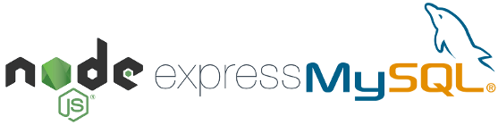

# CRUD-NodeJS-Express-Swagger-MySQL

Simple CRUD example with NodeJS, Express, Swagger and MySQL

## Technologies:

- NodeJS Express v4.17.1
- Swagger UI v3.20.1
- MySQL

## Objective

The objective of this guide is to make a NodeJS Express web API connecting with a MySQL database. The Swagger UI will be used to test the API.

## To run this project

- Run the script located at "/docs/crud.sql" to create the database on MySQL Workbench or on another program of your preference.

- Install the node modules by running the commands below at the root folder:

```batch
    npm install
```

- Run the API:

```batch
    npm start
```

- Acess the URL:

```batch
    http://localhost:3000
```
